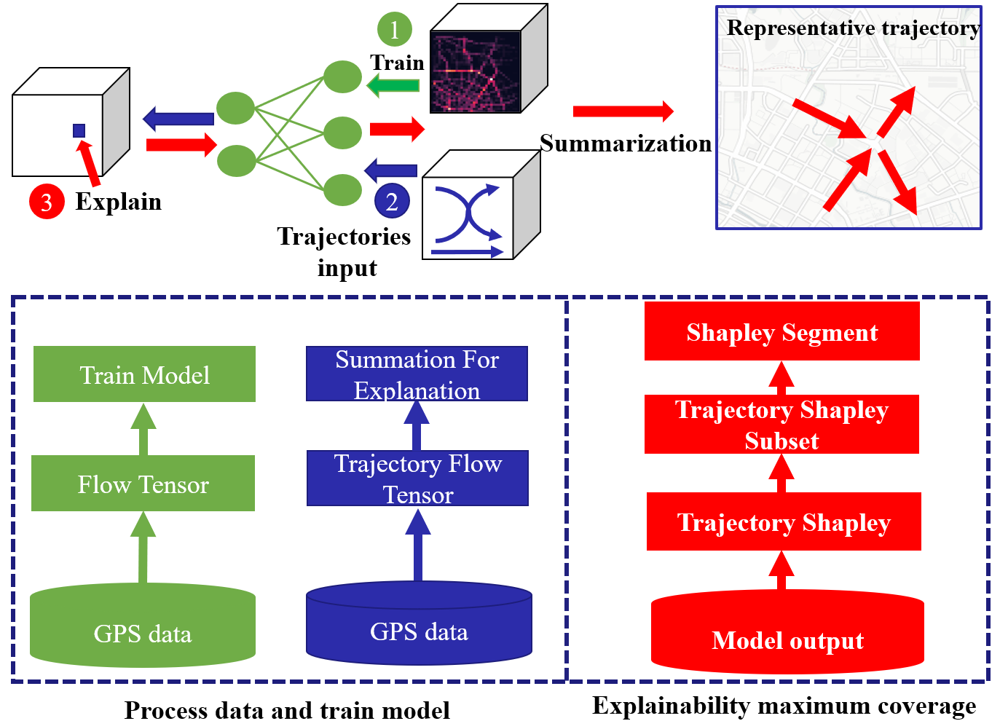
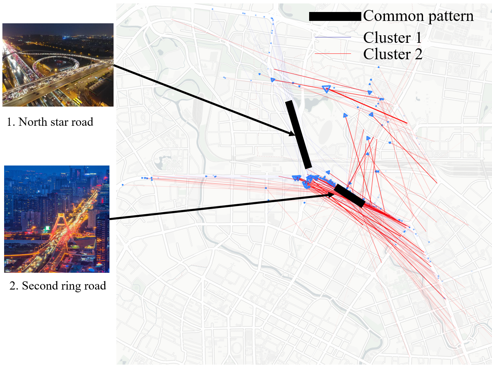
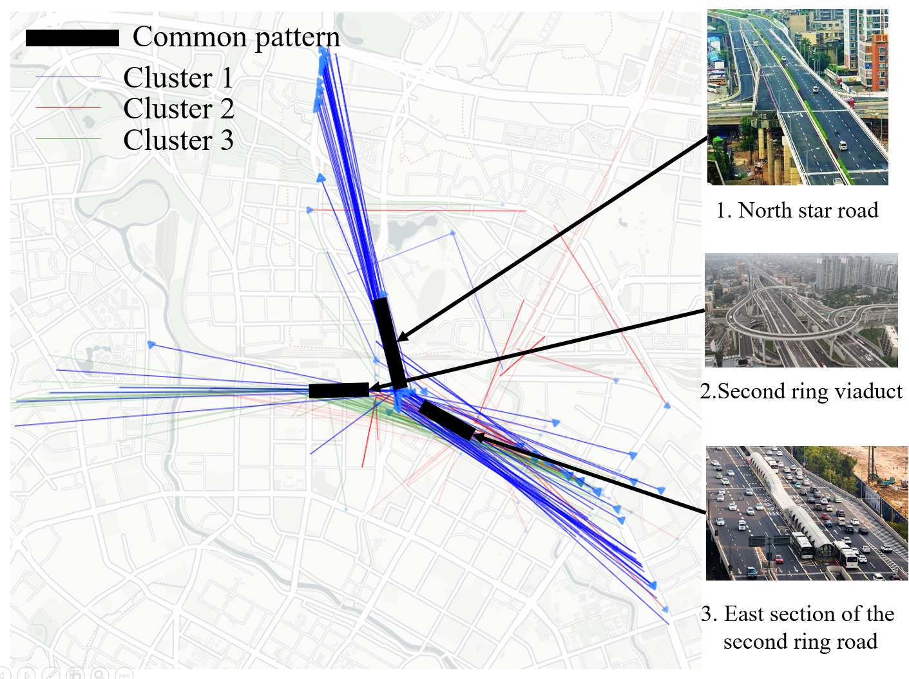

# KDD21
Discovering Key Sub-trajectories To Explain The Traffic Prediction


<center class="half">
    
</center>
## Abstract 
Flow prediction has attracted extensive research efforts; however,
achieving both reliable efficiency and interpretability from a unified model remains a challenging problem. Among the literature,
Shapely offers interpretable and explanatory insights as a unified
framework for interpreting predictions. But, using Shapley directly
in traffic prediction will cause some issues. On one hand, the positive and negative regions correlation of fine-grained interpretation
area is difficult to understand. On the other hand, Shapley method
is an NP-hard problem, which will be accompanied by numerous
possibilities in grid-based interpretation. To this end, in this paper,
we propose Trajectory Shapley, an approximate Shapley approach
by decomposing flow tensor input with a multitude of trajectories
and outputting the trajectories Shapely values at a specific region.
Moreover, the appearance of trajectory is often full of randomness,
which will lead to interpreting result instability. Therefore, we propose the feature-based submodular algorithm to summarize the
representative Shapley pattern. The summarization method can
quickly generate the summary of Shapley distribution on overall
trajectories so that users can quickly understand the mechanism
of the deep model. Experimental results show that our algorithm
can find multiple traffic trends from the different arterial roads and
their Shapely distributions. Our approach is tested on real-world
taxi trajectory datasets and exceeds explainable baseline models.

We provide PyTorch implementations for each baseline model.

**Note**: The current software works well with PyTorch 1.7.0

## Prerequisites

- PyTorch
- Python 3.7
- CPU or NVIDIA GPU + CUDA CuDNN
- shap
- matplotlib
- apricot-select

## Getting Started

### Installation

- Clone this repo:

```bash
git https://github.com/Hongjun-Wang/Explainable_coverage.git
cd Explainable_coverage
```

### Dataset

- Our datasets: 
  > Chengdu and Xi'an DiDi
  >
  >


### Train/test

- Train a model:

```python
cd Explainable_coverage
zip data.7z
#for Chengdu dataset
python train_cnn.py
```


### Example
We have presented a summarization example in Summarization.ipynb


### Result
 The results of spatial visualization in Chengdu are displayed. We  use transparency to represent the Shapley value and show the trajectories. direction to reflect the trend of traffic flow. We can see that most of the people live in the suburbs in the morning, so the traffic flow mainly comes from North Star Road, and then passes through the Second Ring Road, which is successfully perceived by the neural network. Therefore, the distribution with the largest Shapley weight is the part with blue sub-trajectories. On the contrary, after the evening rush hour, people begin to rush from the city to the suburbs during the rush hour. The second loop traffic is successfully mined by the model. We only show the first two classes, because the Shapley value in the later classes is too small to be ignored. 

<center class="half">
    
</center>


 
